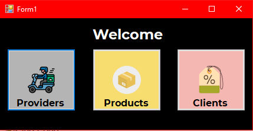

# :computer: Store :computer:

---
## English
```C#
string Greet = "Hello world, my name is Alfredo and this is one of my proyects";

```

> In this proyect I did a CRUD with a View of Products.
 ### About the Application :information_source:

 I did the Store with the SqlServer and C#.

 > :information_source: SqlServer Verison: Microsoft SQL Server 2017 (RTM) - 14.0.1000.169 (X64)  :information_source:
 >
 > :information_source: C# Version: 7.0.5 :information_source:

The application can Create, Read, Update and Delete (CRUD) Deliverys and Products.

The application have fourth views the first is the main view and redirects to the anothers views.



The second view is the view of Delivery in this view can see the register of the database and can create, update, delete delivery.


The third view is the view of Products in this view can see the register of the database and can create, update, delete delivery.


The fourth view is the view of the client where the client can search products and see the data of the stock, etc.


---
## Español
~~~ C#
string Saludar = "Hola mundo, mi nombre es Alfredo y este es uno de mis proyectos";
~~~

> En este proyecto hice un Videojuego de Ping Pong
### Acerca del videojuego :information_source:

Hice la Tienda con SqlServer and C#.

 > :information_source: SqlServer Verison: Microsoft SQL Server 2017 (RTM) - 14.0.1000.169 (X64)  :information_source:
 >
 > :information_source: C# Version: 7.0.5 :information_source:

La aplicacion puede Crear, Leer, Actualizar y Eliminar (CRUD) Deliverys y Productos.

La aplicacion tiene cuatro vistas la primera es la vista principal y redirige hacia las otras vistas.


La segunda vista es la vista de Delivery donde se puede ver los registros de la base de datos y puede crear, actualizar, eliminar delivery.


La tercera vista es la vista de Productos donde se puede ver los registros de la base de datos y puede crear, actualizar, eliminar delivery.


La cuarta vista pertenece al clientedonde se puede buscar productos y ver la informacion del stock, etc.


## :nerd_face: **About me** || **Acerca de mi** :nerd_face:

> :wink: Do you want contact me? :eyes: Check my profile in :point_right: [LinkedIn](https://www.linkedin.com/in/alfredo-rodríguez-orenday-73a14a215/ "Alfredo Rdz O")  

> :wink: ¿Quieres contactarme? :eyes: Checa mi perfil en :point_right: [LinkedIn](https://www.linkedin.com/in/alfredo-rodríguez-orenday-73a14a215/ "Alfredo Rdz O")  